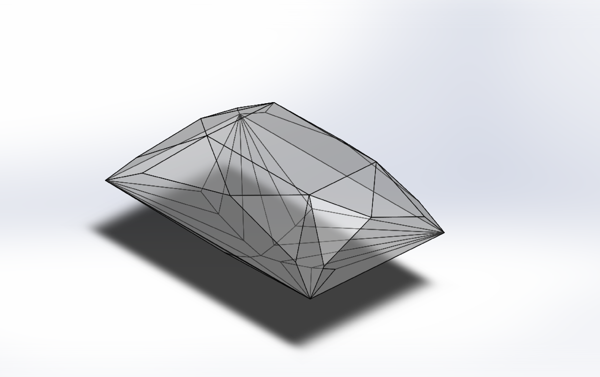
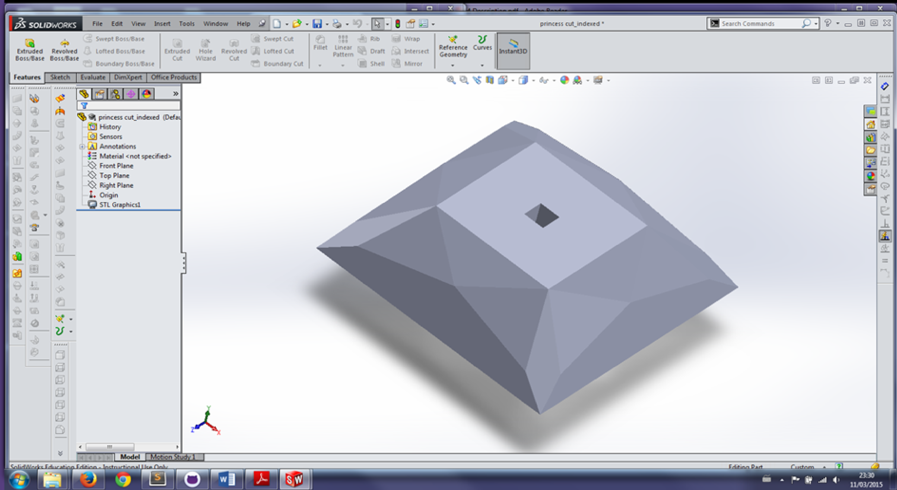
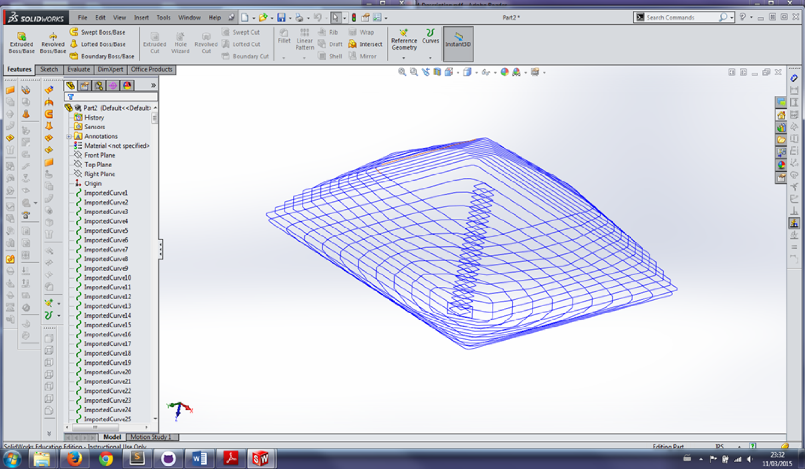
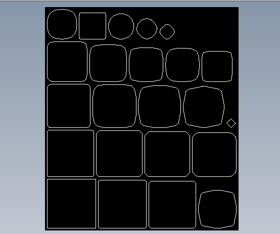

# Slicer
command line STL file slicer for 3D printing

Command line program to slice STL files and use ezdxf to write each layer to a seperate DXF. The program creates a directory to place the layer DXF files.

#### Make something in CAD

#### Then export your CAD model to a STL file

#### Use MooseSlice CLI to slice STL file along arbitrary axis

#### Automatically pack the layers into sheets for Laser or CNC cutting

Dependencies
================
You need the following python packages:

ezdxf version 0.6.2   <https://pypi.python.org/pypi/ezdxf/0.6.2>

There is a later version available, 0.6.5, which should work as the API is the same.

Roadmap
===========
- [x] Add slicing along user defined direction
- [x] Add sheet packing output
- [ ] Replace brute force O(n^3) slicing with elegant O(n^2)
